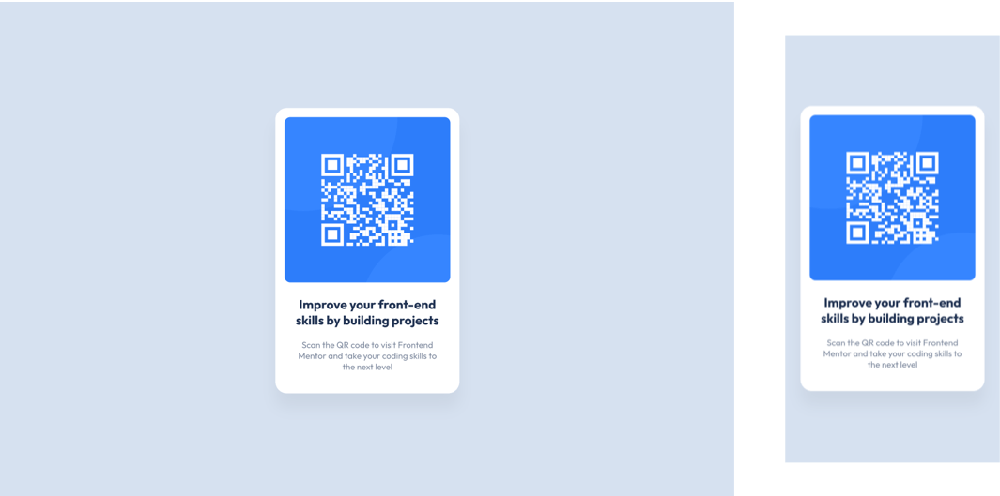

# Frontend Mentor - QR code component solution

This is a solution to the [QR code component challenge on Frontend Mentor](https://www.frontendmentor.io/challenges/qr-code-component-iux_sIO_H). Frontend Mentor challenges help you improve your coding skills by building realistic projects.

## Table of contents

- [Frontend Mentor - QR code component solution](#frontend-mentor---qr-code-component-solution)
  - [Table of contents](#table-of-contents)
  - [Overview](#overview)
    - [Screenshot](#screenshot)
    - [Links](#links)
  - [My process](#my-process)
    - [Built with](#built-with)
    - [Continued development](#continued-development)
      - [`` element](#img-element)
      - [CSS background](#css-background)
  - [Author](#author)

## Overview

### Screenshot

### Links

- Solution URL: [https://github.com/stenito/qr-code-component](https://github.com/stenito/qr-code-component)
- Live Site URL: [https://frontendmentor.stenito.com/qr-code-component/](https://frontendmentor.stenito.com/qr-code-component/)

## My process

### Built with

- Semantic HTML5 markup
- SASS
- Flexbox

### Continued development

Alternative versions

#### `` element

Use `` in HTML for the QR code instead of background in CSS.

- Solution URL: [https://github.com/stenito/qr-code-component](https://github.com/stenito/qr-code-component)
- Live Site URL: [https://frontendmentor.stenito.com/qr-code-component-v2/](https://frontendmentor.stenito.com/qr-code-component-v2/)

#### CSS background

Create circles in QR code background with CSS instead of using an image.

- Solution URL: [https://github.com/stenito/qr-code-component](https://github.com/stenito/qr-code-component)
- Live Site URL: [https://frontendmentor.stenito.com/qr-code-component-v3/](https://frontendmentor.stenito.com/qr-code-component-v3/)

## Author

- Frontend Mentor - [@stenito](https://www.frontendmentor.io/profile/stenito)

**Note: Delete this note and add/remove/edit lines above based on what links you'd like to share.**

